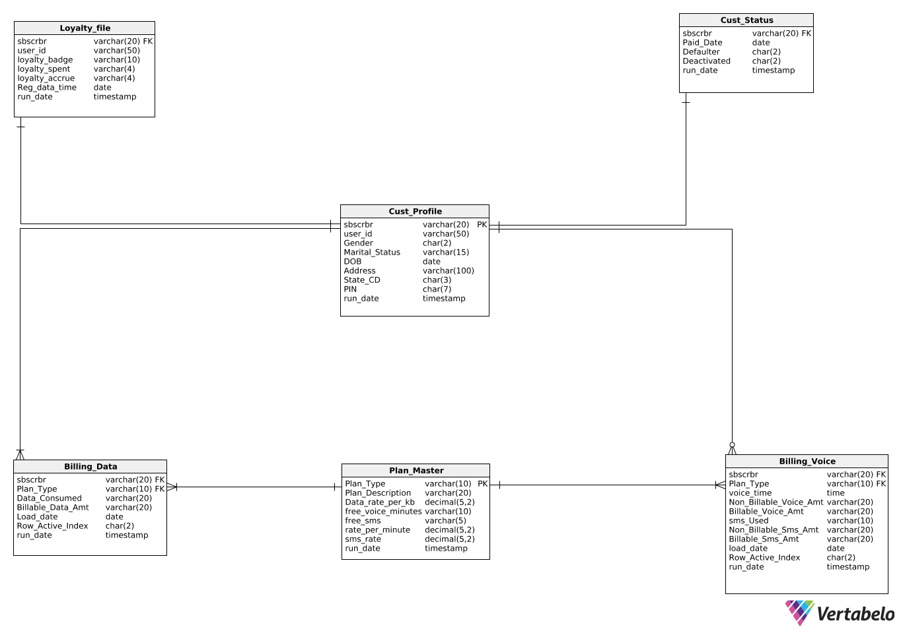

# SLIPSTREAM-AN AUTOMATED ELT PIPELINE FOR CUSTOMER'S VOICE AND DATA PLANS USING TERADATA BTEQ AND TPT UTILITIES

This repository contains the code and resources for the Slipstream project, which involves Extract, Load, and Transform (ELT) operations on a dataset containing both voice and data plans. The primary objective of this project is to develop a robust data model, perform data loading into Teradata tables, execute transformations to address data issues, and ultimately visualize the data using Tableau.

**Data Model**

The data model below shows the architecture of the slipsteam ELT project on the customer's voice and data plans we performed the ELT operation on using Teradata BTEQ and TPT utilities:-

**ELT Process**

The ELT process involves the following steps: 
**Extract:** Data is extracted from the Slipstream dataset. 
**Load:** The extracted data is loaded into Teradata tables using BTEQ and TPT scripts. 
**Transform:** Data transformations are performed to address any data issues and enhance the quality of the data. 
**Load (Final):** The transformed data is loaded into the final destination table. 
**Visualization:** The data is visualized using Tableau and Vertablo for comprehensive analysis and reporting.

**Scripts and Folders**

The repository includes the following folders and scripts: 

Archived Data: Contains archived data files. 
Landing Data: Holds the raw data files extracted from the Slipstream dataset. 
Scripts: Contains BTEQ and TPT scripts for data loading and transformations. 
Reject: Stores rejected CSV files during the transformation process. 
Backup: Stores backup files. 
Logs: Stores logs generated during the ELT process. 

